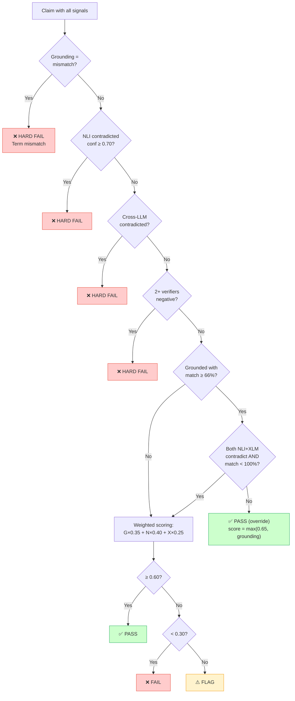
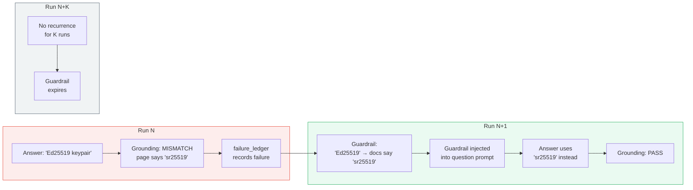

# DocVerify: Complete Technical Reference

*Everything the pipeline does, how it does it, and why. All numbers from the actual source code.*

---

## What This System Is

DocVerify is a multi-agent pipeline that takes PDF documentation, answers questions about it, and then proves whether each answer is correct. It decomposes every answer into individual claims, runs each claim through three independent verification layers, and outputs a scored report showing exactly which claims passed, which failed, and why.

If verification finds problems, the system identifies documentation gaps and writes targeted edits. On the next run those edits become part of the knowledge base, so answers improve over time.

---

## Definitions

**RAG (Retrieval-Augmented Generation):** Instead of asking an LLM to answer from memory, you search a document database for relevant chunks first, then give those chunks to the LLM as context. The LLM answers based only on what it was given.

**Chunk:** A piece of a PDF, ~1000 tokens long with 150 tokens of overlap with adjacent chunks. During ingestion every PDF gets split into chunks and each gets an embedding vector stored in ChromaDB.

**Embedding:** A 384-dimensional numerical vector representing the meaning of text. Similar topics produce vectors close together in vector space. Model: `all-MiniLM-L6-v2` (~80MB, runs locally).

**ChromaDB:** Open-source vector database storing chunks with embeddings for similarity search.

**DeBERTa:** Microsoft's `cross-encoder/nli-deberta-v3-base` (~440MB). Trained on MNLI to classify whether one sentence follows from another. Runs locally on CPU, no API cost, deterministic output.

**NLI (Natural Language Inference):** Classifying whether a hypothesis (claim) is entailed by, neutral to, or contradicted by a premise (evidence). DeBERTa outputs three probabilities summing to 1.0. Thresholds in the code: entailment >= 0.65, contradiction >= 0.70.

**RAGAS (Retrieval Augmented Generation Assessment):** Industry-standard RAG evaluation framework. DocVerify uses RAGAS Faithfulness: it decomposes the answer into claims independently, checks each against context via GPT-4o-mini, and returns `supported_claims / total_claims` (0.0 to 1.0).

**Cross-LLM Checking:** Using a different LLM provider to verify claims. Claude generates answers; OpenAI's gpt-4.1-mini (or Gemini) independently checks if evidence supports each claim.

**Grounding:** Deterministic check that specific terms from a claim literally appear on the cited page. No neural model. If the answer cites page 34, grounding opens page 34 and checks whether the claimed terms are there.

**Claim:** An atomic verifiable statement extracted from an answer. Each has text, cited_file, cited_page, and after verification: final_verdict (pass/fail/flag) and final_confidence (0.0-1.0).

**Verification Floor:** Safety mechanism preventing GPT evaluator variance from failing answers that passed deterministic verification. If claims verify clean but GPT scored low, correctness floors at 0.82.

**Self-Healing:** Failed claims from Run N get recorded. In Run N+1, warnings are injected into the prompt telling the answerer to avoid those specific claims unless it finds explicit evidence.

---

## Pipeline Flow

The pipeline executes as a LangGraph StateGraph with 9 nodes in sequence:

```
ingest -> retrieve -> route -> answer -> verify -> [conditional: loop_b] -> evaluate -> edit -> report
```

### Architecture Graph

```mermaid
flowchart TD
    START([START]) --> INGEST

    subgraph INIT ["Phase 1: Initialization"]
        INGEST["**ingest_node**\nPDF → chunks → ChromaDB\nInit: cache, ledger, NLI, cross-LLM"]
    end

    INGEST --> RETRIEVE

    subgraph PREP ["Phase 2-3: Preparation"]
        RETRIEVE["**retrieve_node**\nTier 1: all chunks\nTier 2: top-12 per question"]
        RETRIEVE --> ROUTE
        ROUTE{{"**route_node** (Kimi K2.5)\nComparison language?\nPlatform names?"}}
    end

    ROUTE --> ANSWER

    subgraph GENERATE ["Phase 4: Generation"]
        ANSWER["**answer_node** (Claude Opus 4.5)\n+ failure ledger guardrails\n+ full_text if Tier 1"]
    end

    ANSWER --> VERIFY

    subgraph VERIFICATION ["Phase 5: Triple Verification"]
        VERIFY["**verify_node**"] --> CACHE{"Cache\nhit?"}
        CACHE -->|All cached| REAGG["Re-aggregate\ncached signals"]
        CACHE -->|Uncached| GROUND["**Layer 1: Grounding**\nDeterministic term match\nmatch_ratio = matched/total"]
        GROUND --> PAR["**Parallel** (ThreadPool)"]
        PAR --> NLI["**Layer 2: NLI**\nDeBERTa\nentailed|neutral|contradicted"]
        PAR --> XLLM["**Layer 3: Cross-LLM**\ngpt-4.1-mini\nsupported|unsupported|contradicted"]
        NLI --> AGG["**aggregate_verdicts()**\nWeights: G=0.35 N=0.40 X=0.25\nHard fails | Override logic"]
        XLLM --> AGG
        AGG --> STORE["Cache store + ledger record"]
        REAGG --> REWRITE
        STORE --> REWRITE{"Failed or\nflagged?"}
        REWRITE -->|Yes| RW["**rewrite_answer()**\nStrip failed → DOC_GAPS"]
        REWRITE -->|No| KEEP["Keep original"]
        RW --> GAPV["**gap_verifier**\nValidate doc gaps"]
        KEEP --> GAPV
    end

    GAPV --> LOOPCHECK{{"Any Loop B?"}}
    LOOPCHECK -->|No| EVALUATE
    LOOPCHECK -->|Yes| LOOPB

    subgraph RESEARCH ["Phase 5b: Loop B (conditional)"]
        LOOPB["**claim_extractor**\nAtomic claims"] --> SEARCH["**research_agent**\nTavily + OpenAI search"]
        SEARCH --> CORR["**correlation_agent**\nDual-citation tables"]
    end

    CORR --> EVALUATE

    subgraph SCORING ["Phase 6: Evaluation"]
        EVALUATE["**evaluate_node**"] --> TPAR["**3 parallel threads**"]
        TPAR --> E1["GPT-5.2 eval #1"]
        TPAR --> E2["GPT-5.2 eval #2"]
        TPAR --> RAGAS["RAGAS faithfulness"]
        E1 --> AVG["Average dual scores"]
        E2 --> AVG
        RAGAS --> BLEND{"RAGAS > GPT\nby >0.10?"}
        AVG --> BLEND
        BLEND -->|">0.20 gap"| B65["GPT×0.35 + RAGAS×0.65"]
        BLEND -->|"0.10-0.20 gap"| B50["(GPT + RAGAS) / 2"]
        BLEND -->|"No/lower"| NOBLEND["Keep GPT score"]
        B65 --> FLOOR
        B50 --> FLOOR
        NOBLEND --> FLOOR
        FLOOR{"Passed?"}
        FLOOR -->|Yes| DONE["✅ PASS"]
        FLOOR -->|No| FLOORCHECK{"genuine_failures\n≤ 2?"}
        FLOORCHECK -->|Yes| APPLYFLOOR["Floor correctness→0.82\nRecompute overall"]
        FLOORCHECK -->|No| REALFAIL["❌ Genuine FAIL"]
    end

    APPLYFLOOR --> EDIT
    REALFAIL --> EDIT
    DONE --> EDIT

    subgraph IMPROVE ["Phase 7-8: Edit & Report"]
        EDIT["**edit_node**\neditor → doc_editor → edit_verifier"]
        EDIT --> REPORT["**report_node**\nMarkdown + JSON"]
    end

    REPORT --> ENDNODE([END])

    style INIT fill:#e8f4f8,stroke:#2980b9
    style PREP fill:#ebf5fb,stroke:#2980b9
    style GENERATE fill:#eafaf1,stroke:#27ae60
    style VERIFICATION fill:#fef9e7,stroke:#f39c12
    style RESEARCH fill:#f5eef8,stroke:#8e44ad
    style SCORING fill:#fdedec,stroke:#e74c3c
    style IMPROVE fill:#f0f3f4,stroke:#566573
```



### Verdict Aggregation Decision Tree



### Self-Healing Across Runs



### Phase 1: Ingest (ingest_node)

Reads all PDFs from `docs/pdfs/`. If edited markdown files exist in `knowledge/edited_markdown/`, those are preferred over original PDFs (this is how self-healing edits accumulate). Splits text into chunks (1000 tokens, 150 overlap), generates embeddings via all-MiniLM-L6-v2, stores in ChromaDB.

Also initializes all shared resources that persist across questions:
- **Claim cache** from `claim_cache.py` (loads previous verification results, tracks PDF hashes for invalidation)
- **Failure ledger** from `failure_ledger.py` (loads historical failures for self-healing guardrails)
- **NLI verifier** (loads DeBERTa model once, shares across all questions)
- **Cross-LLM checker** (initializes OpenAI/Gemini client once)
- **Page index** (maps every `(filename, page_number)` pair to its text content for grounding checks)

Detects **Tier 1** vs **Tier 2**:
- Tier 1 (small corpus): Full text passed directly to the answerer alongside chunks
- Tier 2 (large corpus): Only retrieved chunks passed, answerer works from RAG context only

### Phase 2: Retrieve (retrieve_node)

Loads questions from `evaluation/evaluation_spec.yaml`. For each question, queries ChromaDB for top-12 most similar chunks.

In Tier 1 mode, retrieval is skipped — all chunks serve as evidence for every question.

### Phase 3: Route (route_node)

Classifies each question as **Loop A** or **Loop B** using Kimi K2.5 (cheap, fast classifier).

**Loop A (Internal Only):** Questions about the documented system in isolation. Example: "Why does the peer-to-peer design ensure resilience?" All information exists in the PDFs. This is the fast path.

**Loop B (Research-Augmented):** Questions requiring competitor comparisons. Example: "How does DDC compare to Databricks or Snowflake?" The router detects platform names and comparison language. After the initial closed-book answer, Loop B runs external research via Tavily + OpenAI web search, cross-validates findings, and builds enriched comparison tables with dual citations.

### Phase 4: Answer (answer_node)

Claude Opus 4.5 generates a closed-book answer. Every claim must cite a specific chunk.

**Self-healing injection:** Before generating, the node checks the failure ledger for guardrails specific to this question ID. If previous runs had failed claims, warnings like this get appended to the question:

```
## SELF-HEALING GUARDRAILS
The following claims FAILED verification in previous runs. Do NOT make these claims
unless you find EXPLICIT, WORD-FOR-WORD evidence on the cited page:
  - Claim "Ed25519 keypair" failed: cited page uses "sr25519" not "Ed25519"
  - Claim "coordinator-free" failed: phrase never appears in documentation
```

In Tier 1 mode, the full document text is also passed via `full_text` parameter.

### Phase 5: Verify (verify_node)

This is the core of the system. For each question's answer:

**Step 1 - Decompose:** Claude breaks the answer into atomic claims. Each claim gets a `cited_file` and `cited_page` extracted from the citation format (e.g., `[[doc:whitepaper.pdf, p.34]]`).

**Step 2 - Cache check:** For each claim, check the claim cache using the key `(claim_text, cited_file, cited_page)`. Cached claims get their raw signals re-aggregated with current logic (so cache entries stay valid even if aggregation weights change). Fully cached questions skip verification entirely.

**Step 3 - Grounding (deterministic):** For uncached claims, extract key terms from the claim text and check if they appear on the cited page (plus adjacent pages for boundary cases). Output: `{verdict: grounded|ungrounded|mismatch|uncited, confidence: float, matched_terms: [...], missing_terms: [...]}`.

The `confidence` field is the match ratio: `matched_terms / total_key_terms`. Thresholds:
- match_ratio >= 1.0 with at least 1 match -> grounded
- match_ratio >= 0.5 with at least 2 matches -> grounded
- Any matches but below threshold -> flagged for review
- Zero matches -> ungrounded

Known overclaim patterns get special handling. If the claim uses "Ed25519" but the page says "sr25519", verdict is "mismatch" with 0.95 confidence.

**Step 4 - NLI + Cross-LLM (parallel):** For uncached claims, NLI and cross-LLM run simultaneously via ThreadPoolExecutor(max_workers=2):
- NLI: DeBERTa checks if evidence text entails the claim
- Cross-LLM: gpt-4.1-mini independently checks if evidence supports the claim

**Step 5 - Aggregate verdicts:** All signals combine into a single verdict. Details in the "Verdict Aggregation Math" section below.

**Step 6 - Cache store:** New verification results (grounding, NLI, cross-LLM raw signals) are stored in the claim cache for future runs.

**Step 7 - Record failures:** Failed claims get recorded in the failure ledger for self-healing.

**Step 8 - Rewrite:** If any claims failed or were flagged, the answer is rewritten: failed claims are stripped and moved to a DOC_GAPS section.

**Step 9 - Gap verification:** `gap_verifier_agent` validates that identified documentation gaps are real (not just retrieval misses).

### Phase 5b: Loop B Research (loop_b_research_node, conditional)

Only runs if any question was routed to Loop B. For each Loop B question:
1. `claim_extractor_agent` decomposes the answer into atomic claims tagged with comparison targets
2. `research_agent` runs dual web search (Tavily + OpenAI) for each claim needing external data
3. `correlation_agent` builds enriched comparison tables with internal + external citations

The enriched answer replaces the original.

### Phase 6: Evaluate (evaluate_node)

**Dual evaluation:** GPT-5.2 scores the answer twice in parallel. Both results are averaged to reduce variance.

**RAGAS:** Runs simultaneously (third parallel thread). RAGAS faithfulness score computed with focused contexts built from the pages the answer actually cites.

**Asymmetric RAGAS blending:** RAGAS can only pull scores UP, never down. If RAGAS faithfulness > GPT correctness by more than 0.10, scores are blended. If RAGAS is lower, it's ignored (RAGAS likely had incomplete evidence).

**Verification floor:** If the answer failed evaluation but claims passed deterministic verification, the floor kicks in.

**Approved edits as evidence:** Edits from previous runs that passed verification are injected as additional evidence chunks, so the evaluator doesn't penalize claims that are supported by documentation improvements.

Full scoring math in the next section.

### Phase 7: Edit (edit_node)

`editor_agent` reads evaluation failures, verification failures, and gap reports. Proposes targeted documentation edits. If gaps were verified, `doc_editor_agent` applies edits to markdown files with tracking markers. `edit_verifier` validates the edits.

### Phase 8: Report (report_node)

Generates a markdown report and JSON scores file with full verification details per question.

---

## Evaluation Scoring Math

### The Five Dimensions

Each answer is scored on five dimensions by GPT-5.2. Values range from 0.0 to 1.0.

| Dimension | Weight | What It Measures |
|-----------|--------|-----------------|
| grounded_correctness | 0.40 | Is every claim supported by cited evidence? |
| completeness | 0.20 | Does the answer cover all required concepts from the rubric? |
| precision | 0.15 | Are there unsupported claims, hallucinations, or outside knowledge? |
| citation_quality | 0.15 | Is every substantive claim attributed with a chunk reference? |
| clarity | 0.10 | Are explanations mechanism-level rather than marketing language? |

These weights come from `evaluation_spec.yaml` under `scoring.weights`.

### Overall Score Calculation

```
overall_score = (grounded_correctness * 0.40) +
                (completeness * 0.20) +
                (precision * 0.15) +
                (clarity * 0.10) +
                (citation_quality * 0.15)
```

### Pass/Fail Dual Gate

An answer must pass BOTH conditions:

```
passed = (overall_score >= 0.78) AND (grounded_correctness >= 0.80)
```

These thresholds come from `evaluation_spec.yaml` under `scoring.thresholds`. The dual gate means a fluent but inaccurate answer fails (correctness too low), and an accurate but incomplete answer also fails (overall too low). Neither dimension alone is sufficient.

### Evaluator Scoring Rules

The GPT-5.2 evaluator operates under specific rules from its system prompt:

- A claim without a citation is an UNSUPPORTED claim
- "Generally in distributed systems..." = OUTSIDE KNOWLEDGE = automatic penalty
- If docs don't cover a topic and the answer says "not specified" = CORRECT, no penalty to correctness (only completeness)
- Unsupported security/crypto guarantee = correctness CAPPED at 0.6
- Correctness deductions: -0.10 per overstated claim, -0.15 per fabricated claim

### Dual Evaluation Averaging

The evaluator runs twice per question in parallel. If both runs succeed:

```
for each score dimension:
    averaged_score[dim] = (run1_score[dim] + run2_score[dim]) / 2

averaged_overall = (run1_overall + run2_overall) / 2
```

If one run fails, the other is used alone. If both fail, fallback scores are assigned: `{correctness: 0.75, completeness: 0.75, precision: 0.70, clarity: 0.80, citation_quality: 0.75}` with `passed: False`.

---

## Verdict Aggregation Math

When all three verification layers have run on a claim, `aggregate_verdicts()` in `cross_llm_checker.py` combines them.

### Signal Mapping

Each verifier's output maps to a numeric score (0.0 = unsupported, 1.0 = supported):

**Grounding:**
- grounded -> `0.7 + (0.3 * confidence)` where confidence = match_ratio
  - Example: 4/5 terms matched -> confidence=0.8 -> score = 0.7 + 0.24 = 0.94
- mismatch -> 0.0 (hard zero)
- ungrounded -> `confidence * 0.4` (partial credit for partial matches)
- uncited -> signal omitted (no penalty, no reward)

**NLI (DeBERTa):**
- entailed -> `0.6 + (0.4 * confidence)`
  - Example: entailment=0.85 -> score = 0.6 + 0.34 = 0.94
- contradicted -> 0.0
- neutral -> 0.50 (genuinely uncertain, does NOT drag down a grounded claim)

**Cross-LLM:**
- supported -> 0.85
- contradicted -> 0.0
- unsupported -> 0.35 (couldn't confirm, not necessarily wrong)

### Weighted Combination

```
Verification weights:
  grounding:  0.35
  nli:        0.40
  cross_llm:  0.25

final_score = weighted_average of available signals
```

Only signals that actually ran are included. If NLI is unavailable, grounding and cross-LLM are re-weighted proportionally.

### Verdict Thresholds

```
final_score >= 0.60  ->  pass
final_score <  0.30  ->  fail
0.30 <= final_score < 0.60  ->  flag (uncertain)
```

### Hard Fail Rules (override weighted scoring)

These fire before the weighted calculation:

1. **Grounding mismatch** -> instant fail (e.g., claim says "Ed25519", page says "sr25519")
2. **NLI contradiction with >= 70% confidence** -> instant fail
3. **Cross-LLM contradiction** -> instant fail
4. **Two verifiers say unsupported/contradicted** -> instant fail

### Grounding Override (False Negative Rescue)

This is the critical override that prevents false negatives:

```
IF grounding verdict is "grounded" AND match_ratio >= 0.66 (strong match):
    UNLESS both NLI AND cross-LLM say "contradicted" AND match_ratio < 1.0:
        -> PASS with score = max(0.65, grounding_score)
```

In plain English: if the terms literally appear on the cited page with a strong match ratio, grounding trumps uncertain or wrong neural verifiers. The only exception is when BOTH neural verifiers actively contradict AND grounding isn't a perfect match — then we defer to the verifiers.

This matters because NLI can return "neutral" (which scores 0.50) on claims that are clearly grounded, dragging the weighted score below 0.60. The override catches this.

---

## Asymmetric RAGAS Score Blending

After GPT-5.2 scores the answer and RAGAS computes faithfulness, the system checks for divergence.

### The Asymmetry Rule

**RAGAS can only pull scores UP, never down.**

Why: RAGAS measures "what fraction of claims are supported by the contexts I was given." If RAGAS gets incomplete evidence (which happens when the answer cites pages that weren't in the top-K retrieval), it marks valid claims as unfaithful. So RAGAS being lower than GPT is usually a RAGAS evidence problem, not a real quality problem. But RAGAS being higher than GPT usually means GPT was too harsh.

### Blending Logic

```
IF ragas_faithfulness > gpt_correctness AND divergence > 0.10:
    IF divergence > 0.20:
        blended = gpt_correctness * 0.35 + ragas_faithfulness * 0.65  (trust RAGAS more)
    ELSE:
        blended = (gpt_correctness + ragas_faithfulness) / 2  (50/50 blend)

    grounded_correctness = blended
    Recompute overall_score with new correctness
    Recompute passed with new overall_score

ELIF ragas_faithfulness < gpt_correctness AND divergence > 0.15:
    Do NOT blend. Log "skipped_ragas_lower".
```

### Example

GPT scores correctness at 0.72. RAGAS faithfulness is 0.91. Divergence = 0.19 (> 0.10, < 0.20).

```
blended = (0.72 + 0.91) / 2 = 0.815
```

New correctness is 0.815 instead of 0.72. The overall score gets recomputed with this new correctness value.

---

## Verification Floor

The floor prevents evaluator variance from cascading into false failures.

### When It Activates

After evaluation, if `passed == False`, the system checks verification data:

```
failed_claims = [claims where final_verdict == "fail"]
genuine_failures = count(claims where grounding match_ratio < 0.5)
```

A "genuine failure" is one where grounding couldn't find the terms (match_ratio < 0.5). If match_ratio >= 0.5, the terms were mostly there and the failure is likely a false negative from the neural models.

### Floor Logic

```
IF genuine_failures <= 2 AND there are some failed claims:
    # Most failures are false negatives
    IF grounded_correctness < 0.82:
        grounded_correctness = 0.82
        Recompute overall_score
        Recompute passed

ELIF genuine_failures == 0 AND failed_claims == 0:
    # Zero failures at all, answer is clean
    IF grounded_correctness < 0.82:
        grounded_correctness = 0.82
        Recompute overall_score
        Recompute passed
```

### Why 0.82?

The floor of 0.82 was calibrated so that:
- It's above the `min_correctness` threshold (0.80), so the floor alone is sufficient to pass the correctness gate
- It's not so high that it masks real problems (a genuine failure rate > 2 doesn't get floored)
- Combined with typical scores in other dimensions (completeness ~0.85, precision ~0.85, clarity ~0.90, citation ~0.85), the weighted overall comes out to ~0.84, which passes the 0.78 threshold

### Example

Answer has 45 claims. 3 claims failed verification, but all 3 have grounding match_ratio >= 0.5 (terms were partially found). genuine_failures = 0. GPT scored correctness at 0.68 (harsh day).

Floor activates: correctness becomes 0.82. Overall recomputed:
```
overall = 0.82*0.40 + 0.85*0.20 + 0.85*0.15 + 0.90*0.10 + 0.85*0.15
        = 0.328 + 0.170 + 0.1275 + 0.090 + 0.1275
        = 0.843
```
0.843 >= 0.78 and 0.82 >= 0.80 -> PASS.

Without the floor: correctness 0.68, overall ~0.78, but 0.68 < 0.80 -> FAIL on the correctness gate despite 0/45 genuine failures.

---

## Self-Healing Across Runs

### Run N: Failure Detection

Claim "DDC uses Ed25519 keypairs" fails grounding because the cited page says "sr25519". The failure ledger records:

```json
{
  "question_id": "Q3",
  "claim_text": "DDC uses Ed25519 keypairs",
  "failure_reason": "mismatch: cited page uses 'sr25519' not 'Ed25519'",
  "run_number": 4,
  "grounding_detail": "Claim uses 'Ed25519' but cited page uses 'sr25519' instead."
}
```

### Run N+1: Guardrail Injection

When `answer_node` processes Q3, it calls `failure_ledger.get_guardrails("Q3")`, which returns:

```
"- AVOIDED: 'Ed25519' -> docs say 'sr25519' (mismatch, 4 consecutive failures)"
```

This gets appended to the question text before Claude sees it. Claude, seeing the explicit warning, avoids using "Ed25519" and instead uses the correct "sr25519" from the cited page.

### Decay

Failures decay over runs. A failure that hasn't recurred for several runs eventually expires, so stale guardrails don't accumulate indefinitely.

---

## Claim Cache Mechanics

### Cache Key

```python
key = hash(normalized_claim_text + cited_file + str(cited_page))
```

### What Gets Cached

Raw verification signals, not final verdicts:
```json
{
  "grounding": {"verdict": "grounded", "confidence": 0.85, "matched_terms": [...]},
  "nli": {"verdict": "entailed", "confidence": 0.82},
  "cross_llm": {"verdict": "supported", "confidence": 0.85}
}
```

On cache hit, the raw signals are re-aggregated through `aggregate_verdicts()` with current logic. This means if you change aggregation weights or thresholds, cached entries don't become stale.

### Content-Aware Invalidation

Each PDF's hash is tracked. If an edited markdown file replaces a PDF (self-healing), the hash changes, and all cached verdicts for claims citing that file are automatically invalidated. This prevents stale cache entries from surviving documentation changes.

---

## Evaluation Rubric Structure

Each question in `evaluation_spec.yaml` has:

- **text:** The actual question
- **required_concepts_documented:** Topics the docs DO cover. The answer MUST address these.
- **required_concepts_aspirational:** Topics the docs DON'T cover. The answer gets bonus points for addressing them but is NOT penalized for missing them.
- **forbidden_claims:** Specific claims that are known overclaims. Making these tanks correctness.
- **high_quality_indicators:** What a great answer looks like.
- **doc_coverage_notes:** Explicit notes to the evaluator about what the docs contain and don't contain, so the evaluator doesn't penalize honest "the docs don't specify" statements.

### Global Rules

```yaml
evidence_rule: "Every claim must cite a source"
external_knowledge_rule: "Do NOT use general knowledge unless it appears in the docs"
refusal_rule: "'The docs do not specify X' is a HIGH-QUALITY answer, not a failure"
citation_density: "Minimum 1 citation per paragraph OR 1 per 3 claims"
approved_edit_rule: "Claims supported by approved edits are valid evidence"
```

---

## Model Selection

| Role | Model | Provider | Why |
|------|-------|----------|-----|
| Answerer | Claude Opus 4.5 | Anthropic | Conservative, citation-heavy, follows instructions precisely |
| Evaluator | GPT-5.2 | OpenAI | Different provider than answerer (prevents self-evaluation bias) |
| Router | Kimi K2.5 | Moonshot | Cheap lightweight classifier, no reasoning needed |
| Claim Extractor | Claude Sonnet 4.5 | Anthropic | Cost-efficient for decomposition |
| Correlator | Claude Opus 4.5 | Anthropic | Needs large context for comparison tables |
| Editor | Claude Sonnet 4.5 | Anthropic | Cost-efficient for targeted edits |
| NLI Verifier | DeBERTa-v3-base | Local | Free, deterministic, no API calls |
| RAGAS | GPT-4o-mini | OpenAI | Cheap, well-calibrated for RAGAS internals |
| Cross-LLM | gpt-4.1-mini / Gemini | OpenAI/Google | Independent check from a third provider |
| Embeddings | all-MiniLM-L6-v2 | Local | Fast, small, good quality for retrieval |
